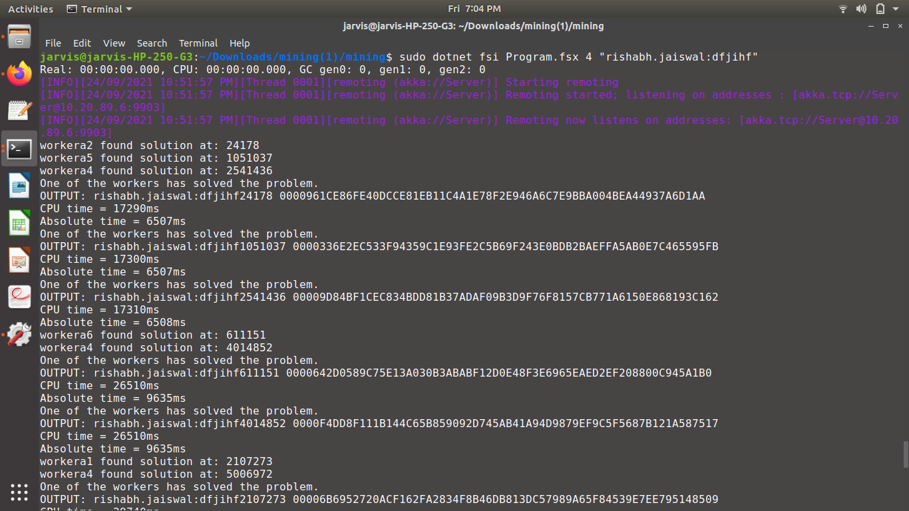
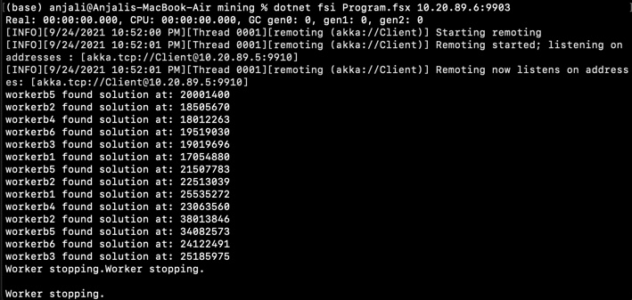
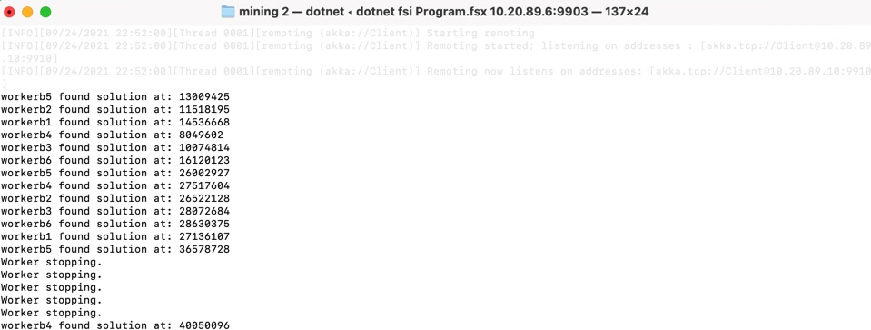
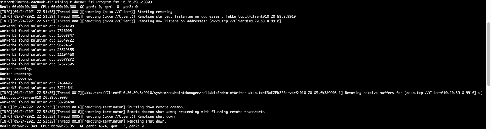
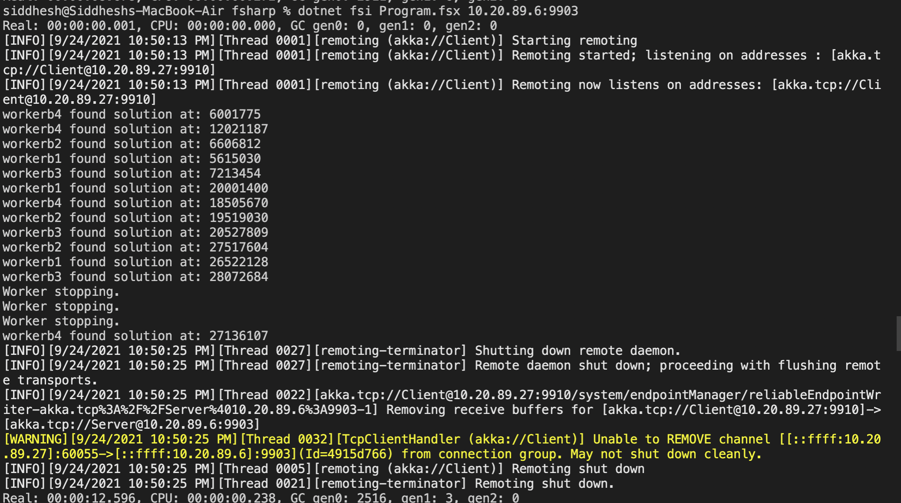
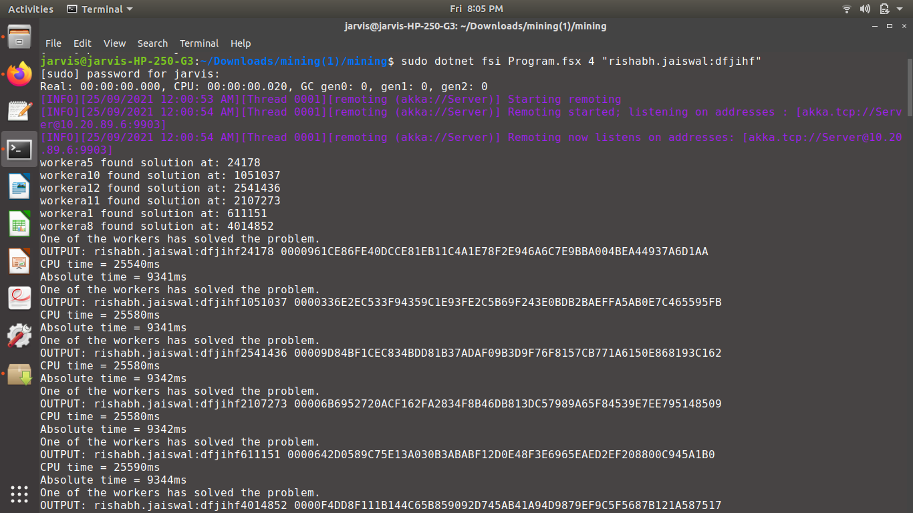

## About

Input to the program is number of leading zeroes required in a result hash and an input string to generate the hash. This program works by concatenating 1...N numbers one by one to the inputstring and checks if the SHA-256 hash has the required number of leading zeroes, if yes, then we are good since we have found the coin (coin is inputStringXXX where XXX is the number, also known as [nonce](https://aantonop.com/glossary-archive/bitcoin-nonce/)). 

We are distributing the work among workers, by providing a range of numbers to each worker. That is, Worker1 gets 1-100000, Worker2 gets 100001-20000. If Worker1 comes back as he didn't find a solution, he is provided with higher range 20001-30000, and so on.. this cycle continues until we find a solution([nonce](https://aantonop.com/glossary-archive/bitcoin-nonce/)) from one of the workers.

The goal of this  project was to use F# and the actor model to build a good solution to this problem that runs well on multi-core machines.

## Run

Machine 1 (Server):

`dotnet fsi Program.jsx 6 "siddheshpatil;okfmasnfnfm"`

Machine 2,3,4,5... (Client):

`dotnet fsi Program.fsx put_server_ip_address_here`

## Questions

Note: The experiment was carried with the aim of finding 50 solutions for each input and test cases.

### 1. What is the size of the work unit that you determined, results in the best performance for your implementation? Explain how you determined it.

Size of Work Unit: 500,000
| Row No. | Leading Zeroes | Input String           | No. of Solutions | Number of Workers                | CPU Time (ms) | Absolute Time (ms) | Ratio   | Increment |
| ------- | -------------- | ---------------------- | ---------------- | -------------------------------- | ------------- | ------------------ | ------- | --------- |
| 1       | 4              | rishabh.jaiswal:dfjihf | 50               | 12                               | 121670        | 46688              | 2.606   | 1000      |
| 2       | 4              | rishabh.jaiswal:dfjihf | 50               | 12                               | 116490        | 44417              | 2.623   | 10000     |
| 3      | 4              | rishabh.jaiswal:dfjihf | 50               | 12                               | 147940        | 54925              | 2.693   | 100000    |
| **4**     | **4**              | **rishabh.jaiswal:dfjihf** | **50**               | **12**                               | **128130**        | **47052**              | **2.723**   | **500000**    |
| 5      | 4              | rishabh.jaiswal:dfjihf | 50               | 12                               | 140070        | 51921              | 2.698   | 700000    |
| 6      | 4              | rishabh.jaiswal:dfjihf | 50               | 12                               | 119940        | 44576              | 2.691   | 1000000   |
| 7      | 4              | rishabh.jaiswal:dfjihf | 50               | 12                               | 120840        | 46582              | 2.594   | 10000000  |

Explanation: As evident from above table, we measured the performance with different workloads, and found at 500000 subproblems it performed the best.
___
### 2. The result of running program for input 4, with CPU, REAL Time.

Each machine had 6 workers. We had 1 server and 4 clients (that is, total: 5 machines). With a workload of 500,000 workunits per worker.

Server (4 cores):

Client 1 (8 cores):

Client 2 (8 cores):

Client 3 (4 cores):

Client 4 (8 cores):

___
### 3. the best running time and ratio for the above input 4 leading zeroes.

**When tested on 1 machine (12 workers, 500000 workunits for each worker):**

4 cores:

    Real  Time: 128,130 milliseconds

    CPU Time: 47,052 milliseconds

    Ratio: 2.723

**When tested on 5 machines (6 workers, 100000 workunits for each worker):**

    Real  Time: 28,504 milliseconds

    CPU Time: 76,050 milliseconds

    Ratio: 2.668

___
### 4. The coins with the most 0s you managed to find.

8 leading zeroes.

rishabh.jaiswal:nachos270860675 000000000C8A07621DE19BCF74ABAD4A85841040AD27FDA8CD1EEC2DCE26EC6C
___
### 5. The largest number of working machines you were able to run your code with.

5 machines.
___
## Dependencies

1. FSharp
2. .NET
3. [Akka.NET](https://www.nuget.org/packages/Akka/)

## Team Members
- Siddhesh P Patil (siddheshpatil@ufl.edu)
- Rishabh Jaiswal (rishabh.jaiswal@ufl.edu)